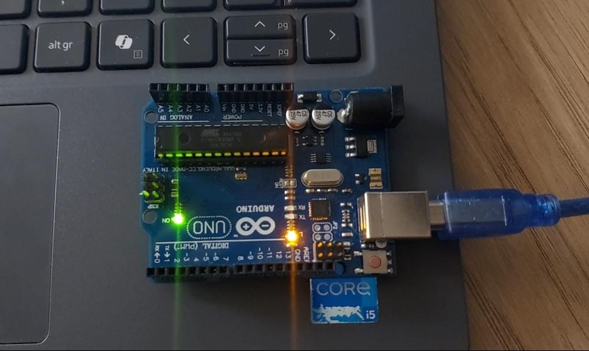
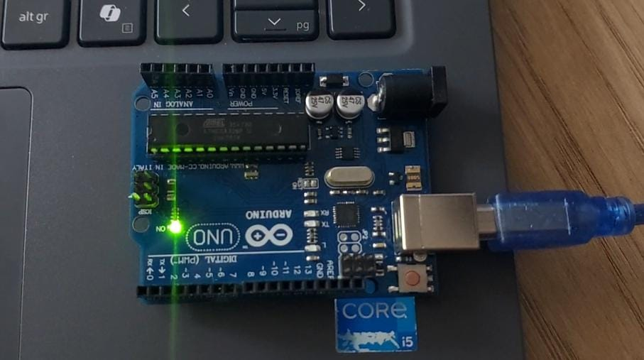
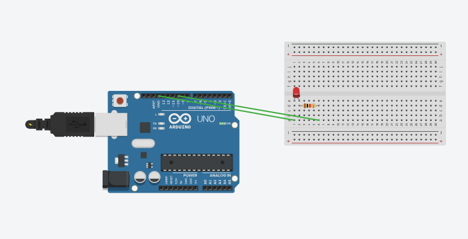

# Projeto Arduino: LED Pisca-Pisca 🎄🎄🎄

### Autora: Mirela Bianchi

Este projeto tem como objetivo aprender a controlar LEDs utilizando o Arduino Uno, tanto o LED interno da placa quanto um LED externo, criando efeitos de acendimento e apagamento (blink) de forma contínua. O projeto também inclui a simulação do circuito no TinkerCad.

## Índice

- [Parte 1 - LED Interno](#parte-1---led-interno)
- [Parte 2 - LED Externo](#parte-2---led-externo)
- [Referências](#referências)

## Parte 1 - LED Interno

Nesta etapa, o objetivo foi controlar o LED interno do Arduino (LED embutido no pino 13), fazendo-o acender e apagar de forma contínua, gerando o efeito de "pisca-pisca".

**Passos:**
- Conecte o Arduino Uno ao computador usando o cabo USB;
- Abra o Arduino IDE no computador;
- No código, configure o pino do LED interno como saída;
- Faça o upload do código para o Arduino.
- Observe o LED interno piscando conforme o tempo definido no delay.

**LED interno acesso:**  

  
  LED externo  
  
  
   
  Fonte: produzido por Mirela

 

**LED interno apagado:**  

  
  LED externo  
  
  
   
  Fonte: produzido por Mirela

 

**Vídeo de demonstração:**  
[(Clique aqui para ver o vídeo)](https://drive.google.com/file/d/1yaYDstOt35K4jSVJio4xX6U4fy4tEc9T/view?usp=sharing)

## Parte 2 - LED Externo

Para aprofundar o aprendizado, adicionamos um LED externo ao projeto. Ele será controlado pelo Arduino usando um pino digital (ex.: pino 6), utilizando um resistor para proteger o LED.

**Componentes necessários:**
- Arduino Uno;
- LED externo;
- Resistor de 220Ω ou 330Ω;
- Protoboard;
- Jumpers;

**Passos:**
- Conecte o terminal positivo (ânodo) do LED à linha correspondente ao pino 6 do Arduino na protoboard.
- Conecte o terminal negativo (cátodo) do LED ao resistor.
- Conecte o outro terminal do resistor ao GND do Arduino.
- No Arduino IDE, configure o pino digital 6 como saída e faça o LED piscar.
- Faça o upload do código para o Arduino.
- Observe o LED externo piscando junto com ou independente do LED interno.

Imagem do projeto:

  
  LED externo  
  
  
   
  Fonte: produzido por Mirela

 

**Projeto no TinkerCad:**  
[(Clique aqui para ver o projeto no TinkerCad)](https://www.tinkercad.com/things/jMhBvGEVxED/editel?returnTo=%2Fdashboard)

## Referências

ARDUINO. Arduino Official Documentation. Disponível em: <https://www.arduino.cc/>. Acesso em: 16 out. 2025.  
TINKERCAD. TinkerCad Circuits. Disponível em: <https://www.tinkercad.com/circuits>. Acesso em: 16 out. 2025.
